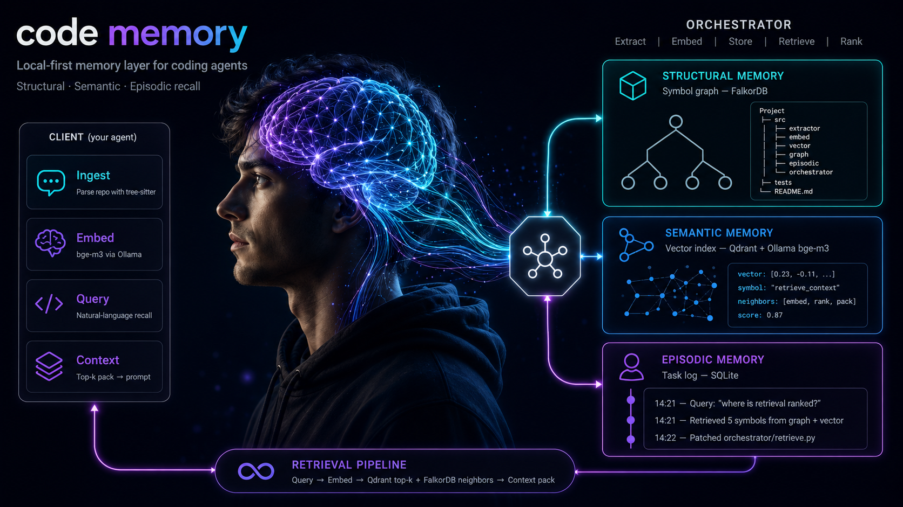
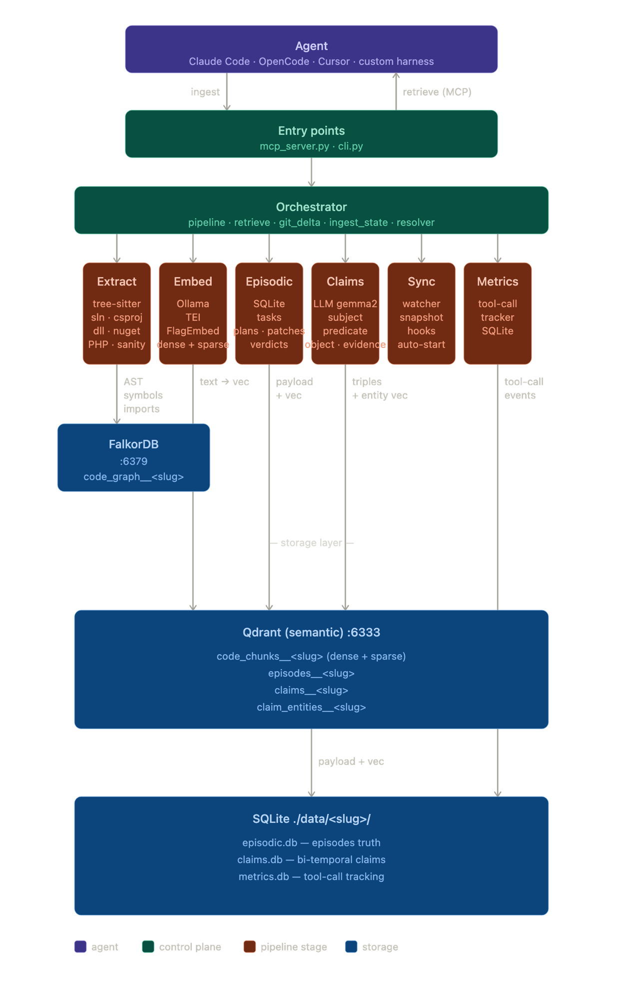

<div align="center">



# code-memory

**A lightweight, local-first memory layer for coding agents.**

Structural symbol graph &nbsp;·&nbsp; semantic vector recall &nbsp;·&nbsp; episodic task log

---

[](https://www.python.org/)
[](https://www.falkordb.com/)
[](https://qdrant.tech/)
[](https://ollama.com/library/bge-m3)
[](https://tree-sitter.github.io/)
[](LICENSE)

**Jump to:** [Get it running](#installation) &nbsp;·&nbsp; [Update it](#updating) &nbsp;·&nbsp; [Plug it into your agent](#mcp-server) &nbsp;·&nbsp; [How it scores vs `rg`](#benchmarks)

</div>

<div align="center">

### How code-memory scores vs raw `ripgrep`

_Full tables + methodology in [Benchmarks](#benchmarks)._

**Semantic retrieval** _(Angular sample app, 2.6k files, 30 hand-crafted queries — [Benchmark 1](#benchmark-1--code-memory-vs-no-code-memory-baseline))_

| | code-memory | ripgrep |
|---|---:|---:|
| **Recall@10** | **0.967** | 0.367 |
| **MRR** | **0.798** | 0.169 |
| **nDCG@10** | **0.840** | 0.218 |
| **p50 latency (ms)** | **86** | 176 |

**Topology queries** _(this repo, 111 Python files, symbol `FalkorStore` — [Benchmark 3](#benchmark-3--topology-queries-graph-vs-grep-)_

| | code-memory | ripgrep |
|---|---:|---:|
| **"Who imports module M?"** | **6 true positives** | 7 (1 false positive) |
| **"Who calls / references X?"** | **7 typed edges** | 14 lexical hits |
| **Definitions of X** | `{file, start, end, kind}` JSON | 1 grep line |
| **Output for the agent to read back** | **5-30× smaller** | full file dump |

**The pitch in one line:** Recall@10 +164% vs `rg`, *and* topology results small enough that the agent reads them back without re-grepping. code-memory is 0.5-0.8 s per topology query vs `rg`'s 30 ms — slower per call but **5-30× less context** to feed back, which is what actually costs agent tokens.

**Ingest once, sync everywhere — full semantic + graph, no quality tradeoff:**

- **Snapshot publish/sync**: ingest once on a fast machine (CI / power dev box), `code-memory snapshot publish` to a git branch, every other machine runs `code-memory sync` after `git pull` and gets the full state — **vectors, graph, episodic — in seconds, no embedder run**. Tested end-to-end: cold ingest → publish → wipe → sync restores `retrieve` / `callers` / `definitions` / `importers` exactly. With HEAD ahead of the snapshot, sync auto-applies the snapshot + runs the incremental delta.
- **Persistent content-hash embedding cache** makes any re-ingest on the same machine a SQLite scan: **55.7 s → 2.9 s = 19× faster** when nothing changed. Full Recall@10, default `bge-m3`.
- **Linux + NVIDIA** unlock for the cold-once-in-CI build: `EMBED_BACKEND=tei` for 5-10× cold ingest vs Ollama, **same `bge-m3` weights, identical retrieval quality**.

`retrieve` / `callers` / `definitions` / `importers` all stay on, all return the same answers they did before any of these speedups. See [Performance & scale](#performance--scale).

</div>

---

> [!NOTE]
> **Using this with a coding agent?** My personal Claude Code / OpenCode harness — hooks, agents, MCP wiring, and the `code-memory` integration — lives at **[dev/settings-opencode](https://github.com/dev/settings-opencode)**. Drop-in reference for plugging this memory layer into a real agent setup.

---

## Installation

> [!TIP]
> ### 🔄 Already installed? Update in one command.
>
> ```bash
> code-memory update          # smart refresh: CLI + Docker images + present Ollama models + plugins
> code-memory update --check  # dry-run: print current vs latest, exit non-zero if behind
> code-memory update --full   # re-run the one-liner installer (adds anything missing)
> ```
>
> `update` is **idempotent and selective** — it only touches components that are already
> installed locally. No re-prompting for extras you opted out of, no docker churn if
> compose isn't on this machine. Run it weekly, or after a release announcement.
>
> Bleeding edge from `main`: `code-memory update --bleeding`. Full details below in
> [Updating](#updating).

`code-memory` installs in **one command**. Pick your OS, paste it, you're done.

**🍎 macOS**

```bash
curl -fsSL https://raw.githubusercontent.com/fmflurry/code-memory/main/install.sh | bash
```

**🐧 Linux**

```bash
curl -fsSL https://raw.githubusercontent.com/fmflurry/code-memory/main/install.sh | bash
```

**🪟 Windows**

```powershell
irm https://raw.githubusercontent.com/fmflurry/code-memory/main/install.ps1 -Headers @{ 'Cache-Control' = 'no-cache' } | iex
```

If PowerShell reports a parser error at `install.ps1:392` showing the old
here-string terminator piped to `Write-Host`, you are running a stale
release/checkout. Update to `main`, or delete and re-download the installer
from the `main` URL above before running it.

The installer fetches the CLI, drops `docker-compose.yml` into `~/.code-memory/`, starts **FalkorDB** + **Qdrant**, pulls **`bge-m3`**, and wires the **Claude Code** + **OpenCode** plugins. Idempotent — safe to re-run.

### ✅ Verify

```bash
code-memory --version
code-memory health
```

`health` should print 🟢 for FalkorDB, Qdrant, and Ollama. Then point it at a repo:

```bash
code-memory ingest .
```

### 📦 Prereqs (auto-pulled where possible)

|                              |                                                                       |
| ---------------------------- | --------------------------------------------------------------------- |
| **Python 3.11+**             | Orchestrator + CLI runtime                                            |
| **Docker + Compose v2**      | FalkorDB (`:6379`) + Qdrant (`:6333`)                                 |
| **Ollama**                   | Long-running embedding daemon (keeps `bge-m3` warm)                   |
| **Disk ~3 GB · RAM 8 GB+**   | 16 GB+ recommended for large repos                                    |
| **OS**                       | macOS / Linux / Windows (WSL2 **or** native PowerShell)               |

Optional: `gemma2:9b` (~5.4 GB) — pull only if you turn on `CLAIMS_EXTRACTION=true` ([see User-claim extraction](#user-claim-extraction-graphiti-style)). Full matrix in [Stack reference](#stack-reference).

### 🎛 Advanced install paths

<details>
<summary><strong>One-liner flags — opt out of pieces</strong></summary>

**macOS / Linux**

```bash
curl -fsSL https://raw.githubusercontent.com/fmflurry/code-memory/main/install.sh \
  | bash -s -- --no-docker --no-ollama --no-claude --no-opencode --no-mcp
```

| Flag            | Effect                                                  |
| --------------- | ------------------------------------------------------- |
| `--no-docker`   | Don't start FalkorDB + Qdrant (using remote infra)      |
| `--no-ollama`   | Don't pull `bge-m3` (already present, or remote)        |
| `--no-claude`   | Skip Claude Code marketplace + plugin                   |
| `--no-opencode` | Skip OpenCode plugin                                    |
| `--no-mcp`      | Skip Claude Code MCP server registration                |

**Windows** — `iex` doesn't accept args, so download then run:

```powershell
iwr https://raw.githubusercontent.com/fmflurry/code-memory/main/install.ps1 -Headers @{ 'Cache-Control' = 'no-cache' } -OutFile install.ps1
./install.ps1 -NoDocker -NoOllama -NoClaude -NoOpencode -NoMcp
```

| Switch        | Effect                                                  |
| ------------- | ------------------------------------------------------- |
| `-NoDocker`   | Don't start FalkorDB + Qdrant                           |
| `-NoOllama`   | Don't pull `bge-m3`                                     |
| `-NoClaude`   | Skip Claude Code marketplace + plugin                   |
| `-NoOpencode` | Skip OpenCode plugin                                    |
| `-NoMcp`      | Skip MCP server registration                            |

</details>

<details>
<summary><strong>Manual install (à la carte, no one-liner)</strong></summary>

```bash
# 1. CLI (PyPI — recommended)
uv tool install flurryx-code-memory
# or: pipx install flurryx-code-memory
# or: pip install flurryx-code-memory
#
# Bleeding edge from main:
#   uv tool install --from git+https://github.com/fmflurry/code-memory flurryx-code-memory

# 2. Infra (compose + env)
mkdir -p ~/.code-memory/docker
curl -fsSL https://raw.githubusercontent.com/fmflurry/code-memory/main/docker/docker-compose.yml \
  -o ~/.code-memory/docker/docker-compose.yml
curl -fsSL https://raw.githubusercontent.com/fmflurry/code-memory/main/.env.example \
  -o ~/.code-memory/.env
docker compose -f ~/.code-memory/docker/docker-compose.yml --project-directory ~/.code-memory up -d

# 3. Embedding model
ollama pull bge-m3

# 4. Claude Code plugin + MCP
claude plugin marketplace add https://github.com/fmflurry/code-memory
claude plugin install code-memory@code-memory --scope user
claude mcp add code-memory --scope user \
  -e CODE_MEMORY_PROJECT=auto \
  -- uvx --from flurryx-code-memory code-memory-mcp

# 5. OpenCode plugin
npm i -g code-memory-opencode
code-memory-opencode-install

# 6. Cursor plugin (requires repo cloned; package release pending)
git clone https://github.com/fmflurry/code-memory ~/.code-memory/repo
~/.code-memory/repo/plugins/cursor/install.sh
```

</details>

<details>
<summary><strong>MCP-only (lightest, ~10 s)</strong></summary>

Just the Claude Code MCP server — no auto-learn / auto-record hooks, no Docker, no Ollama. Useful when FalkorDB + Qdrant already run elsewhere, or you only want the `codememory_*` tools by hand.

```bash
claude mcp add code-memory \
  -- uvx --from flurryx-code-memory code-memory-mcp
```

</details>

<details>
<summary><strong>Self-hosted infra (no Docker on dev box)</strong></summary>

Edit `~/.code-memory/.env` (or `%USERPROFILE%\.code-memory\.env`) to point at remote endpoints:

```ini
FALKOR_HOST=falkor.internal
FALKOR_PORT=6379
QDRANT_URL=https://qdrant.internal:6333
OLLAMA_HOST=http://ollama.internal:11434
```

Re-run the one-liner with `--no-docker --no-ollama` (or `-NoDocker -NoOllama` on Windows).

</details>

<details>
<summary><strong>Contributor install (clones repo, editable)</strong></summary>

For hacking on code-memory itself — editable `pip install -e .`, test suite, optional plugin pointers to the source tree.

**macOS / Linux**

```bash
git clone https://github.com/fmflurry/code-memory.git
cd code-memory
./scripts/install.sh                  # interactive
./scripts/install.sh --plugins=all    # non-interactive
```

**Windows (PowerShell)**

```powershell
git clone https://github.com/fmflurry/code-memory.git
cd code-memory
./scripts/install.ps1
```

`scripts/install.sh` checks prereqs, creates `.venv`, runs `pip install -e ".[dev]"`, copies `.env.example` → `.env`, starts docker compose, pulls `bge-m3`, runs `pytest -q`, optionally installs OpenCode and/or Claude Code plugins.

</details>

---

## Updating

After the initial install, never run the one-liner again — use the built-in updater:

```bash
code-memory update            # smart, idempotent, no re-prompts
code-memory update --check    # dry-run; exit 1 if behind, 0 if current
code-memory update --full     # behave like a fresh one-liner install
code-memory update --bleeding # install CLI from git+main instead of PyPI
```

### What it does

`update` introspects your machine and refreshes **only what is already installed**:

| Component                   | Detection                                              | Refresh action                                    |
| --------------------------- | ------------------------------------------------------ | ------------------------------------------------- |
| **CLI**                     | `sys.prefix` (uv tool / pipx / pip / editable)         | upgrade via the same channel                      |
| **FalkorDB + Qdrant**       | `~/.code-memory/docker/docker-compose.yml` or running  | `docker compose pull && up -d`                    |
| **Ollama models**           | present in `ollama list` (`bge-m3`, `gemma2:9b`, …)    | `ollama pull <model>` (only for already-pulled)   |
| **Claude Code plugin**      | `claude plugin list \| grep code-memory`                | `claude plugin install … --force`                 |
| **OpenCode plugin**         | `npm ls -g code-memory-opencode`                       | `npm i -g code-memory-opencode`                   |
| **Python extras**           | `FlagEmbedding` / `dnfile` import probe                | covered by the CLI upgrade                        |

Anything you **didn't** install stays untouched. No "do you want gemma?" prompt, no
docker churn on a machine that hits remote infra, no plugin re-registration if you
deliberately removed it.

### Sample output

```
$ code-memory update --check
code-memory updater  (install: uv-tool)
  CLI: 0.4.0  →  latest: 0.5.0
  Components detected locally:
    • Docker: FalkorDB  (running)
    • Docker: Qdrant  (running)
    • Ollama: bge-m3
    · Ollama: gemma2:9b  [not installed — skip]
    • Claude Code plugin
    • Claude Code MCP
    · OpenCode plugin (npm)  [not installed — skip]
```

Use `code-memory update --check` from CI or a cron to nudge devs when a release ships.

---

## What is this?

`code-memory` gives a coding agent (Claude Code, OpenCode, Cursor, your own harness) a memory it can actually use:

- **Structural memory** — a symbol graph of every file, function, import, and call (FalkorDB).
- **Semantic memory** — dense embeddings of every symbol (Qdrant + Ollama-served `bge-m3`), with an opt-in dense+sparse hybrid path for symbol-heavy corpora.
- **Episodic memory** — a task log of past prompts, plans, patches, and outcomes (SQLite + embedded recall).

It runs entirely on your machine. No OpenAI calls. No cloud. No vendor lock-in. Designed to be _boring infrastructure_ you can wire into any harness via CLI, hooks, or MCP.

<div align="center">
  
</div>

---

## Why it doesn't blow up your context window

Naive "give the LLM your whole repo" approaches die fast: context windows are
finite, attention degrades with size, and tokens cost money. `code-memory`
sidesteps that by **keeping the bulk of the knowledge outside the prompt** and
injecting only a small, query-relevant slice when the agent actually needs it.

The trick is a two-phase split:

1. **Offline — index everything, inject nothing.**
   Ingest walks the repo once, chunks code with tree-sitter, embeds each chunk
   with `bge-m3` (default: served by **Ollama** so the model stays warm across
   per-file save-hook re-ingests; opt-in `EMBED_BACKEND=flagembed` for true
   dense+sparse), and stores:
   - vectors in **Qdrant** (semantic recall, hybrid-ready collection layout)
   - symbol / import / call edges in **FalkorDB** (structural recall)
   - past prompts / plans / patches / verdicts in **SQLite** (episodic recall)

   None of this lives in the LLM context. It lives on disk.

2. **Online — retrieve a small, focused Context Pack.**
   When the agent has a question, it sends a natural-language query. The
   retriever:
   - embeds the query and pulls top-k semantically similar chunks from Qdrant
   - expands the neighborhood in FalkorDB (callers, callees, imports, types)
   - pulls a few similar past episodes from SQLite
   - returns a compact, ranked **Context Pack** — typically a handful of
     snippets, not the whole repo

The agent only ever sees the Context Pack, not the index behind it. The repo
can be 5 MB or 500 MB — what hits the prompt is the same small budget of
relevant chunks.

```
500 MB repo on disk     ─┐
                         │   index (Qdrant + FalkorDB + SQLite)
                         ▼
                  ┌──────────────┐
   query  ──────► │  retriever   │ ──►  ~few KB Context Pack  ──►  LLM prompt
                  └──────────────┘
```

Net effect: memory grows with the repo; **context stays roughly constant**.

---

## Two-stage retrieval: bi-encoder + cross-encoder (+ hybrid opt-in)

Retrieval quality is the difference between an agent that hits the right file
on the first try and one that flounders for ten tool calls. `code-memory` runs
a **two-stage** pipeline with a third opt-in lexical layer:

### Stage 1 — `bge-m3` bi-encoder (always on, default path)

Every code chunk is embedded once with `bge-m3`. The default backend is
**Ollama** — the daemon keeps the model warm across short-lived processes,
which matters because the Claude Code / OpenCode plugins fire a per-save
`code-memory reingest <path>` after every `Write|Edit`. An in-process
embedder would pay a multi-second cold load on every save; Ollama costs ~0
extra startup.

The query is embedded the same way, and Qdrant returns the top-N chunks by
cosine similarity in milliseconds. Collection layout is named-vector (`dense`
+ `sparse` slots) so the door stays open for lexical fusion without
re-ingestion; the `sparse` slot is simply empty under the Ollama backend.

### Hybrid opt-in — `EMBED_BACKEND=flagembed` + `CODEMEMORY_HYBRID=1`

For corpora where the agent queries mostly by exact symbol name
(`JwtAuthGuard.canActivate`, `useCustomerStore`), you can flip to the
in-process FlagEmbedding backend, which emits **both** the dense vector
**and** a learned sparse lexical vector from one forward pass:

```bash
uv sync --extra hybrid
export EMBED_BACKEND=flagembed
export CODEMEMORY_HYBRID=1
# then re-ingest so the sparse slot gets populated
code-memory ingest . --full
```

Queries then go through Qdrant's server-side **Reciprocal Rank Fusion**:

```
RRF(d) = Σ_branches  1 / (k + rank_branch(d))
```

Why this is **opt-in, not default**: benchmarks on a 2.6k-file Angular
corpus (see [`docs/BENCHMARK.md`](docs/BENCHMARK.md)) showed pure dense
outperforming hybrid (RRF and DBSF) on realistic queries — m3's dense head
is strong enough that adding sparse tends to surface generated API stubs
and `.spec.ts` files that share identifier vocabulary with the query,
without bringing new wins. And the FlagEmbedding backend trades Ollama's
warm-daemon model for an in-process load (~5-15 s) which is a regression
for hook-driven workflows. Re-run `scripts/benchmark.py` against your own
corpus before flipping it.

### Stage 2 — cross-encoder rerank (auto on Metal/CUDA, blended)

The top-N candidates from stage 1 are then rescored by a **cross-encoder**
(`BAAI/bge-reranker-v2-m3` by default): query and chunk are concatenated and
fed through a transformer that produces a *joint* relevance score. Because
the model attends to both sides simultaneously, it picks up semantic
relationships a bi-encoder cosine sim misses. The tradeoff: one forward pass
per *pair*, so it only makes sense on the already-narrow candidate set —
never on the whole index.

The final score is a **blend**, not a replacement:

```
score = (1 - α) · bi_encoder_score + α · cross_encoder_score
```

with `α = 0.5` by default. We picked blending after A/B testing replace-mode
on a real Angular repo: the cross-encoder won on 2/5 queries (promoted the
actual token-manager service over generic error interceptors; promoted the
concrete `phone.validator` over a generic spec file), tied on 2/5, and
*regressed* on 1/5 (promoted a mock CORS file to #1 for "authentication
login flow"). Blending recovers from the regression while keeping the wins.

### Policy

- **`auto`** (default) — cross-encoder fires only when a Metal (Apple
  Silicon) or CUDA accelerator is detected. CPU-only hosts stay on bi-encoder
  alone — the latency hit isn't worth it.
- **`CODEMEMORY_RERANK=1`** — force on (even CPU).
- **`CODEMEMORY_RERANK=0`** — force off.
- **`CODEMEMORY_RERANK_ALPHA=0.7`** — push more weight to the cross-encoder
  (or `0.0` to fall back to pure bi-encoder without disabling the load).
- **`CODEMEMORY_RERANK_MODEL`** — swap the cross-encoder (default
  `BAAI/bge-reranker-v2-m3`).

Install the optional dependency once:

```bash
uv sync --extra rerank        # or: pip install -e .[rerank]
```

On a first call the model warms up (~2-5 s, ~1.1 GB from HF cache); after
that it's a singleton (~50-200 ms per query on MPS).

---

## Benchmarks

All benchmarks run on the same anonymized corpus — `acme/sample-webapp`,
~2.6k files, 5.5k chunks of an Angular clean-architecture frontend — and
the same 30 hand-crafted queries (`scripts/benchmark_queries.json`, mix of
natural-language and PascalCase identifier searches). Hardware: Apple
Silicon (MPS), fp16.

### Benchmark 1 — code-memory vs no-code-memory baseline

Does plugging code-memory into an agent actually help, vs the default
agent fallback (ripgrep keyword search)?

| Mode | Recall@10 | MRR | nDCG@10 | p50 (ms) |
|------|----------:|----:|--------:|---------:|
| grep (no code-memory) | 0.367 | 0.169 | 0.218 | 176 |
| **code-memory (dense)** | **0.967** | **0.798** | **0.840** | **86** |
| code-memory (dense + CE rerank) | 0.967 | 0.573 | 0.672 | 7855 |

**Headline:** Recall@10 **+164%**, MRR **+372%**, nDCG@10 **+285%** —
**and faster** than walking the filesystem (86 ms vs 176 ms) because
Qdrant ANN beats `rg -l` over thousands of files. The cross-encoder
regresses on this corpus; α=0.5 blending dampens but doesn't erase it.

Full per-query breakdown, top-5 paths, and latency p95 in
[`docs/BENCHMARK_VS_BASELINE.md`](docs/BENCHMARK_VS_BASELINE.md).
Regenerate against your own corpus:

```bash
uv run python scripts/benchmark_vs_baseline.py \
    --project <slug> --corpus /path/to/repo \
    --out docs/BENCHMARK_VS_BASELINE.md
```

### Benchmark 2 — dense vs hybrid vs cross-encoder rerank

Once you've decided to use code-memory, which retrieval mode wins?

| Mode | Recall@5 | MRR | nDCG@10 | p50 (ms) |
|------|---------:|----:|--------:|---------:|
| **dense (default)** | **0.967** | **0.798** | **0.840** | 36 |
| hybrid (`EMBED_BACKEND=flagembed` + `CODEMEMORY_HYBRID=1`) | 0.900 | 0.680 | 0.750 | 34 |
| dense + CE rerank | 0.900 | 0.568 | 0.668 | 8853 |
| hybrid + CE rerank | 0.933 | 0.787 | 0.831 | 10446 |

**Read it this way:** the m3 dense head is strong enough on its own that
adding the sparse view via RRF surfaces spec/generated noise without
clear wins. Cross-encoder rerank improves hybrid (closes the gap to
~0.787 MRR) but never beats pure dense, and costs ~200× the latency. We
ship **dense via Ollama as the default** and keep hybrid + rerank behind
opt-in env vars for corpora where the tradeoffs flip.

Full breakdown in [`docs/BENCHMARK.md`](docs/BENCHMARK.md). Regenerate:

```bash
uv run python scripts/benchmark.py --project <slug> --out docs/BENCHMARK.md
```

### Benchmark 3 — topology queries (graph vs grep) ⭐

Retrieval is half the story. Real coding agents constantly ask **"who
calls X?", "where is X defined?", "who imports module M?"** — graph
questions a vector index can't answer. The other natural baseline is
`rg`. Run on this repo (code-memory itself), symbol `FalkorStore`,
module `code_memory.graph.falkor_store`:

**Headline:** 4/4 task families where code-memory's output is either
strictly more precise than `rg` (T4 — zero false positives where `rg`
hits a fixture string) or **5-30× smaller in bytes for an agent to
read back** (T1, T2, T3 — ranked + deduped + jump-ready). The latency
hit (sub-second vs `rg`'s 30 ms) buys correctness + token efficiency.

| Task | code-memory | ripgrep | Why it matters for an agent |
|------|------------:|--------:|-----------------------------|
| Semantic Q ("how is the resolver wired into ingest") | **8 ranked hits** w/ scores + line ranges | 91 file paths, unranked | Agent reads 1-3 cm hits directly; with `rg` it must re-grep + read 91 files to find which 3 matter |
| Callers + refs of `FalkorStore` | **7 deduped files** (graph-typed) | 14 file paths (lexical) | cm distinguishes real callers from string/comment matches; one query, no false-positive culling |
| Definitions of `FalkorStore` | `{file, start, end, kind}` JSON | one line of grep output | cm output is jump-ready — agent skips the disambiguation round-trip |
| Importers of `code_memory.graph.falkor_store` | **6 true importers**, both relative + absolute forms canonicalized | 7 files (1 false positive — a test that only mentions the path in a fixture string) | cm parses the import statement and normalizes ``from ..graph.falkor_store`` to the canonical module key so one query catches every form |

Latency: cm topology queries return in **0.5 – 0.8 s**; `rg` in **30 ms**.
**cm is slower per query, but produces 5-30× less context to feed back
into the agent** — which is what actually costs tokens. On a large
private .NET monorepo (~17k C# files, 100k+ symbols) the same queries
stay sub-second.

Two concrete precision fixes landed in this release:

- **REFERENCES edges for type-position usage.** Before: `callers IFoo`
  on a C# repo returned 0 because the graph only modeled call
  expressions — `class X : IFoo`, `void Do(IFoo p)`, `List<IFoo>` left
  no edge. Now the extractor emits **REFERENCES** edges (base lists,
  parameter / field / property / return types, generics, type
  constraints, cast / is / as / typeof) and `callers` unions
  `CALLS | REFERENCES`. End-to-end: `callers IFooService` on a C# repo
  now returns the impl class **and** every consumer that declares the
  interface as a dependency.
- **Canonical import aliasing.** Before: `importers code_memory.graph.falkor_store`
  returned 2 (the test files that used the absolute form). The 4 files
  using `from ..graph.falkor_store import …` were invisible because the
  graph stored a literal ``..graph.falkor_store`` Module key. Now the
  Python import extractor captures `relative_import` properly and the
  resolver derives the canonical dotted-module name (`pkg.sub.leaf`)
  for every relative import target, emitting alias `IMPORTS` edges.
  Same query → **6 true importers**, all forms covered.

Regenerate against any indexed repo:

```bash
scripts/benchmark_vs_grep.sh \
    /path/to/repo <project-slug> <Symbol> <module.path> \
    "natural-language semantic query" [file-ext]
```

### Caveats

- These results reflect **one Angular codebase**. Symbol-heavy or
  polyglot corpora may favor hybrid; LLM-style narrative corpora may
  favor the cross-encoder. Always re-run on your own corpus before
  changing defaults.
- Gold paths are substring matches against `hit.payload.path`. Good for
  A/B comparison, not absolute IR.
- Rerank latency includes a cold model load on the first query; warm
  calls drop to ~250 ms per query but stay dominated by N pairs ×
  forward-pass cost.
- Benchmark 3 topology timings are warm-cache. A cold semantic query
  pays a one-time ~8 s embedding model load; topology queries
  (`callers` / `definitions` / `importers`) skip the embedder entirely
  and stay sub-second from the first call.

---

## Performance & scale

Ingest cost is dominated by the embedder, not the graph store. On a
real private .NET monorepo (~17k C# files, 134k symbols), the
breakdown is:

| Stage | Time | Share |
|-------|-----:|------:|
| Tree-sitter extraction | ~0.1 s / 100 files | < 1% |
| FalkorDB graph upserts (UNWIND-batched) | ~10 ms / file | ~3% |
| Qdrant vector upserts | ~50 ms / batch of 64 | ~2% |
| **Ollama `bge-m3` embedding** | **~50 ms / chunk** | **~95%** |

**Goal:** enterprise-acceptable ingest with **full semantic recall on**.
Not "fast at the cost of dropping features". Default mode keeps the
graph + vectors + episodic stack exactly as documented; the wins below
all preserve `retrieve` / `callers` / `definitions` / `importers`.

Today the dominant cost is the embedder. `bge-m3` via Ollama runs at
~21 chunks/sec on Apple Silicon (Metal-optimised in `llama.cpp`); a
134k-chunk monorepo therefore has a ~1-hour cold-embed floor on
consumer hardware. Three changes flip the wait curve from "unusable"
to "boring infrastructure":

#### Persistent content-hash embedding cache (the headline win)

SQLite `hash(chunk_text) + model → vector`. Lives in
`$DATA_DIR/embed_cache.sqlite` (project-agnostic so the same content
across repos shares a vector). The flow:

1. Before each embed call, every chunk's UTF-8 SHA-256 is looked up in
   the cache.
2. Hits skip the model entirely; only the miss list goes to Ollama /
   FlagEmbedding.
3. New vectors get written back in one transaction.

**Result on this repo (112 Python files, 1,146 chunks):**

| Run | Wall time | Throughput |
|-----|----------:|-----------:|
| Cold ingest (cache empty) | 55.7 s | ~20 chunks/s (Ollama floor) |
| Warm re-ingest (cache full) | **2.9 s** | ~1,145 cached hits, 0 embeds |

That's **19× faster** on the warm path **with full semantic recall
preserved**. The cache is the difference between "ingest is a daily
ceremony" and "ingest is a no-op when nothing changed."

Disable with `EMBED_CACHE_DISABLED=1` if you need a clean
embed pass (e.g., after changing models — though the cache namespaces
on `model_id`, so model switches don't actually pollute).

#### Pipelined embed + Qdrant upload

`embed batch N` runs while `qdrant upload batch N-1` is still in
flight. ThreadPoolExecutor with bounded queue (depth 4) so upserts
can't fall arbitrarily behind. Modest on Apple Silicon (Ollama
serialises), bigger on Linux + NVIDIA where the embedder is faster
than the qdrant network path.

#### `UNWIND`-batched Falkor upserts (already shipped)

Was one `MERGE` query per node / edge — a file with 50 symbols +
imports + calls hit Falkor 50 times. Now grouped by `label` (nodes)
and `(src_label, type, dst_label)` (edges) and shipped as one `UNWIND
$rows` per group: ~50 round-trips → ~3 per file. ~10× faster graph
layer; especially visible on import-heavy languages.

#### Cross-file embedding batches (already shipped)

Per-file Ollama HTTP calls had a ~75 ms fixed overhead. Buffering
chunks across files (flush at 64) and pushing them in one call cuts
that to a per-batch overhead.

### Snapshots: ingest once, sync everywhere ⭐

The cold-ingest cost on Apple Silicon is hardware-bound: `bge-m3` on
Metal caps at ~21 chunks/sec, full-stop. A 17k-file monorepo therefore
takes ~2 h cold no matter how clever the rest of the pipeline gets.

The fix isn't faster embedding on Mac — it's **never running the
embedder on Mac**. Build the index once on a fast machine, publish a
snapshot, distribute via git. Every other developer runs a single
`code-memory sync` after `git pull` and gets the full state (vectors
+ graph + episodic state + ingest pointer) in seconds.

```bash
# On the canonical machine (CI runner, dev workstation, GPU host):
code-memory ingest /path/to/repo --full      # paid once
code-memory snapshot publish                 # → tar.gz on a git branch
                                             #   (default: codemem-snapshots)

# On every other machine, after `git pull`:
code-memory sync                             # auto-detects snapshot at HEAD
                                             #   or recent ancestor, applies
                                             #   it, then ingests just the
                                             #   delta since the snapshot.
```

What `sync` actually does, in order:

1. `git fetch` the snapshot branch (skip with `--no-fetch`).
2. If a snapshot exists for current HEAD → pull + apply. No embedder.
3. If HEAD has moved past the latest snapshot → pull the ancestor
   snapshot, apply it, then run `ingest --since=<snapshot-sha>` to
   process only the post-snapshot delta.
4. If HEAD matches local state already → noop.
5. If you're sitting on the canonical branch and pass `--publish` →
   re-publish a fresh snapshot when the sync completes.

Verified end-to-end on a fresh repo (full test in
`tests/test_snapshot_e2e.py`):

| Step | Wall time |
|------|----------:|
| Cold ingest (2 files, 2 chunks) | ~10 s (Ollama warmup-dominated) |
| `snapshot publish` (push tar.gz to git branch) | <1 s |
| `sync` after wipe (snapshot matches HEAD) | **0.5 s** |
| `sync` with HEAD one commit ahead | **0.9 s** (snapshot + 1-file incremental) |

The snapshot is a single tar.gz containing `manifest.json`,
`vectors/code.jsonl` (every Qdrant point with its dense + sparse
vector), `graph/nodes.jsonl`, `graph/edges.jsonl`, and the ingest
state pointer. Verified by SHA-256 digest in the manifest before
apply; mismatched `embed_model` / `embed_dim` is a hard refuse.

Distribution channel is **just git**: the snapshot lives on a
dedicated branch (`codemem-snapshots` by default), so it inherits
authentication, signing, ACLs from your existing git setup. No S3,
no separate service.

**Practical pattern for a team of N developers:**
- CI runs `code-memory sync --publish` on every merge to `main`.
- Devs run `code-memory sync` whenever they want fresh state — `git
  pull && code-memory sync` is the canonical workflow.
- Mac dev never pays the cold-ingest cost. Linux + NVIDIA + TEI in CI
  does it once per merge, ~15-25 min on a 17k-file monorepo, and
  publishes a snapshot the whole team consumes in seconds.

### Mac cold ingest: bounded by `bge-m3` on Metal

On Apple Silicon, `bge-m3` runs at ~21 chunks/sec via the Metal-tuned
`llama.cpp` path inside Ollama. That's the hardware ceiling for full
recall on Mac — no faster path exists today without giving up
retrieval quality, and we don't ship trades that change what the
agent finds.

The default-mode story is therefore:

- Stay on **`bge-m3`**. Recall@10 0.967 on the shipped benchmark,
  p50 query ~87 ms, 1024-d vectors.
- Cold ingest of ~2.6k files takes ~5 min once. After that, the cache
  takes over — every re-ingest is a SQLite scan, embedder cold-skip,
  graph + qdrant upsert. Measured **2.9 s** on this repo.
- If your daily flow is "save a file → watch reingest", that's
  already ~70 ms unchanged (cache + UNWIND batching handle it).

The ceiling-raise — same model, same recall, faster server — is TEI
below on Linux + NVIDIA. That's the only path that takes cold ingest
faster without compromising retrieval quality.

### Enterprise GPU path: text-embeddings-inference (TEI)

For cold ingest on a real GPU — the actual enterprise scenario, where
CI ingests a multi-tens-of-thousands-of-files monorepo on every
non-trivial merge — drop in HuggingFace's
[`text-embeddings-inference`](https://github.com/huggingface/text-embeddings-inference)
as the embedding backend. Same `bge-m3` weights, **5-10× the Ollama
throughput on Linux + NVIDIA**, no recall change. The cache and
pipelined upserts continue to apply on top.

```bash
# Start TEI alongside FalkorDB + Qdrant
docker compose --profile tei -f docker/docker-compose.yml up -d

# Point code-memory at it
export EMBED_BACKEND=tei
export TEI_URL=http://localhost:8080

# Ingest as usual; semantic retrieve / callers / definitions /
# importers all behave identically — only the backend changed.
code-memory ingest /path/to/repo --full
```

The Compose file ships a CPU TEI image by default so you can smoke-test
the wiring on a laptop. To enable CUDA on a Linux + NVIDIA host,
uncomment the `deploy.resources.reservations.devices` block in
`docker/docker-compose.yml`.

Expected impact on a ~17k-file C# monorepo (~134k chunks):

| Path | Today (Ollama / Mac Metal) | With TEI on Linux + NVIDIA |
|------|---------------------------:|---------------------------:|
| Cold full ingest | ~2 h | **~15-25 min** |
| Huge-delta merge (~5k chunks new) | ~10 min | **~1-2 min** |
| Warm re-ingest (cache hits) | ~3 min | ~3 min (cache-bound, embedder irrelevant) |

The cache key is shared between Ollama and TEI when both serve the
same model — switching backends does **not** invalidate the cache,
so the Mac dev who pre-warmed with Ollama doesn't pay to re-embed
when pointing at the CI's TEI.

### Optional: `--no-vectors` for graph-only workloads

A separate use case exists for agents that only consume `callers` /
`definitions` / `importers` and never call `retrieve`. For those,
`code-memory ingest --no-vectors` skips the embedder entirely.
Measured: ~50 files/s on this repo, ~80 files/s on a 17k-file C# monorepo. Use it
when you've decided semantic recall isn't in the agent's loop, not as
a workaround for slow ingest — the cache above already solves the
slow-ingest problem with full features.

### Honest limits today

- **On Mac, `bge-m3` caps at ~21 chunks/sec via the Metal-tuned
  llama.cpp path.** That's the cold-ingest floor for full recall on
  laptop work. The cache makes everything after the first ingest
  cheap. The enterprise ceiling-raise — same model, same recall — is
  the TEI backend above on Linux + NVIDIA.
- **Resolver is a full-graph scan after every delta ingest.** Watch
  mode doesn't trigger it; only `code-memory ingest`. Stings on a CI
  ingest of a hub-symbol-heavy repo (~5-30 s). Incremental resolver
  is on the list.
- **Single-process ingest.** Tree-sitter extraction is CPU-bound and
  could parallelize across cores; current walk is sequential. Below
  the noise floor while embedding dominates; becomes meaningful once
  TEI is in front and the embedder is no longer the bottleneck.

---

## Auto-learning and auto-query

Without MCP, the agent has to call `code-memory retrieve` and `code-memory
record` explicitly (or via a hook). That works but pushes discipline onto
the user and the agent. The goal is to make memory **ambient**: the agent
uses it without thinking about it, and the memory updates itself as the
agent works.

This is what the **MCP server** unlocks.

### Auto-query

Exposed as an MCP server, `code-memory` advertises tools like:

- `memory.retrieve(query, k)` — semantic + graph recall
- `memory.neighbors(symbol)` — structural expansion around a symbol
- `memory.episodes(query)` — similar past tasks

The agent's normal tool-selection loop picks `memory.retrieve` the same way it
picks `Read` or `Grep` today — whenever the model judges that more context
would help. No slash command, no hook, no human in the loop. The user just
asks their question; the agent silently pulls the right chunks before
answering.

In practice this means:

- "How does the auth middleware work?" → agent calls `memory.retrieve("auth
middleware")` → gets the relevant 3-5 chunks → answers.
- "Refactor `UserService` to use the new repo pattern." → agent calls
  `memory.neighbors("UserService")` → sees every caller and dependency before
  touching code.
- "We had this bug last month, what did we do?" → agent calls
  `memory.episodes(...)` → recalls the prior fix.

### Auto-learning

The same MCP surface exposes write-side tools:

- `memory.record(prompt, plan, patch, verdict)` — log a finished task
- `memory.reingest(path)` — refresh the index for a changed file

Combined with editor / harness hooks (file save, commit, task completion),
this closes the loop:

- **File saved** → `memory.reingest(path)` keeps the index live, so retrieval
  never goes stale.
- **Task finished** → `memory.record(...)` writes the episode (what was
  asked, what was planned, what was patched, did it pass) into SQLite +
  Qdrant.
- **Next similar task** → that episode surfaces automatically via
  `memory.episodes(...)`.

The result is a memory that **gets smarter the more the agent uses the
codebase**, without ever bloating the context window. Each task teaches the
system; each query pays back only the few KB that are actually relevant.

Between sessions, `code-memory ingest` uses a **git delta** to catch up
anything the live hooks missed — see [Git-aware incremental
ingest](#git-aware-incremental-ingest) below.

> Status: an MCP server ships in the package (see [MCP server](#mcp-server)
> below). The same primitives remain reachable via the CLI (`retrieve`,
> `record`, `reingest`) for shell-hook workflows.

---

## User-claim extraction (Graphiti-style)

Code chunks and episodes are great for *code-shaped* memory, but the user
also drops **factual claims** in prose: "we use Postgres", "deploy goes
through Cloud Run", "the auth module is owned by Bob". Today those facts
get buried inside opaque episode blobs. Code-memory can extract them as
structured `(subject, predicate, object)` triples and store them on a
**bi-temporal timeline** — exactly the trick Graphiti uses, minus the
Neo4j and the cloud LLM.

### How it works

1. The Claude Code / OpenCode **Stop hook** fires at the end of every
   turn (already in place to record episodes).
2. It calls the new CLI subcommand `code-memory extract-claims --prompt
   "..."` in a **detached fire-and-forget process** so the user's session
   ends immediately.
3. The CLI spawns a local **Ollama** model (`gemma2:9b` by default) in
   JSON-mode with a constrained output schema and pulls out claims.
4. Claims are validated:
   - `evidence_span` must be a literal substring of the prompt
     (anti-hallucination guard).
   - `confidence` below `CLAIMS_MIN_CONFIDENCE` (default `0.6`) is
     dropped.
   - Duplicates are deduplicated case-insensitively.
5. The store applies **contradiction handling**: single-valued
   predicates (`uses`, `prefers`, `deployed-to`, `owns`, …) automatically
   close the prior assertion's `valid_to` when a new conflicting one
   arrives.
6. Each row carries `valid_at` (when you said it), `valid_to` (NULL
   while current), `recorded_at` (system clock), and `head_sha` (git
   HEAD at extraction time) — so you can ask "what did the user say
   about X **as of commit Y**?".

### Enabling it

```bash
# one-time: pull the model (~5.4 GB)
ollama pull gemma2:9b
# or: ./scripts/install.sh --with-claims

# turn it on
export CLAIMS_EXTRACTION=true
```

You can override the model with `CLAIMS_LLM_MODEL` (any chat-capable
Ollama model that honors `format: <json-schema>`).

### Entity resolution

Each unique subject / object is canonicalised via a tiny
**per-project Qdrant collection** (`claim_entities__<slug>`). On
extraction, the resolver embeds the surface form, searches for nearest
neighbours, and:

- reuses the existing entity ID when cosine similarity ≥
  `CLAIMS_ENTITY_THRESHOLD` (default `0.85`); the new surface form is
  appended to the entity's `aliases` payload, and
- mints a fresh UUID when no close match exists.

`Postgres`, `postgres`, and `Postgres DB` therefore collapse to one
entity even when the LLM emits them differently. The IDs land on the
claim row as `entity_subject_id` / `entity_object_id` columns (both
nullable — legacy rows from before the resolver shipped stay valid).

Tune the threshold with `CLAIMS_ENTITY_THRESHOLD`. Lower values merge
more aggressively (risk: false merges across distinct entities);
higher values keep entities apart (risk: duplicates for the same
entity).

### Reading claims back

Via the MCP server:

```
codememory_claims(project="<slug>")                  # all currently-valid
codememory_claims(project="<slug>", subject="user")  # filter by subject
codememory_claims(project="<slug>", as_of=1717286400) # point-in-time
```

Claims also surface automatically inside the `codememory_retrieve`
Context Pack when the per-project `claims.db` has rows whose
subject / object / evidence overlap with the query. Token-overlap
scoring with a 30-day recency half-life keeps durable preferences
("we use Postgres") visible across sessions while letting recent
reassertions float to the top.

**Dedupe.** Re-asserting the same `(subject, predicate, object, polarity)`
no longer inserts a new row — the existing open row is refreshed in
place (`recorded_at` bumps, `confidence` rises monotonically, blank
`evidence_span` is overwritten by a non-empty one, but `session_id` /
`source_prompt_id` keep the FIRST observation's provenance). This
prevents row-count bloat when the plugins' "ACT BEFORE ANSWERING"
nudge causes the agent to re-assert across turns. Polarity flips and
different-object assertions still go through the bi-temporal close
path (`valid_to` set on the prior row).

Via the CLI, query the SQLite store directly:

```sql
sqlite3 ./data/<slug>/claims.db \
  "SELECT subject, predicate, object, datetime(valid_at, 'unixepoch')
   FROM claims WHERE valid_to IS NULL ORDER BY valid_at DESC LIMIT 20"
```

### Costs

- **Disk**: ~5.4 GB for `gemma2:9b`. The model is shared across all
  projects on the host.
- **Latency**: ~1.5–3 s per prompt on Apple Silicon. Runs in a detached
  process post-turn, so this never adds to a session's wall-clock.
- **Privacy**: prompts never leave the host — Ollama is local, claims are
  stored in per-project SQLite under `./data/<slug>/claims.db`.

### When to skip it

- You don't share much factual context in prose (everything is in code
  comments / commit messages already).
- You're on a CPU-only host where 9B inference is too slow.
- You prefer a smaller, faster model — set
  `CLAIMS_LLM_MODEL=qwen2.5:7b-instruct` or `llama3.2:3b`. Quality drops
  on negation / hypotheticals, but extraction is 2-4x faster.

---

## Stack reference

What the one-liner actually puts on your machine. Full install commands are in the [Installation](#installation) section at the top.

### Runtime services (Docker)

| Service       | Image                         | Purpose                                                    |
| ------------- | ----------------------------- | ---------------------------------------------------------- |
| FalkorDB      | `falkordb/falkordb:latest`    | Redis-protocol graph DB — call/import graph, claim store   |
| Qdrant        | `qdrant/qdrant:latest`        | Vector DB — semantic chunks (dense, optionally sparse)     |

### Local daemons

| Daemon  | Why                                                                                     |
| ------- | --------------------------------------------------------------------------------------- |
| Ollama  | Long-running embedding server; keeps `bge-m3` warm across CLI hook invocations          |

### Python runtime (CLI + MCP server)

| Package                       | Role                                                                  |
| ----------------------------- | --------------------------------------------------------------------- |
| `httpx`                       | HTTP client for Ollama / Qdrant / TEI                                 |
| `qdrant-client`               | Qdrant SDK                                                            |
| `falkordb`                    | FalkorDB driver (Redis protocol)                                      |
| `tree-sitter` + `tree-sitter-language-pack` | Syntax-aware extractor (Python, TS, Go, Rust, C++, Java, PHP, …) |
| `pydantic`                    | Config + claim schemas                                                |
| `typer` + `rich`              | CLI                                                                   |
| `mcp`                         | Anthropic Model Context Protocol server SDK                           |
| `anyio`                       | Async runtime (works under asyncio + trio)                            |
| `watchdog`                    | Filesystem watcher (incremental re-ingest on save)                    |

### Optional extras

| Extra      | Adds                                                                 | Size       |
| ---------- | -------------------------------------------------------------------- | ---------- |
| `[hybrid]` | `FlagEmbedding` + `torch` — in-process BGE-M3 dense+sparse           | ~2.3 GB    |
| `[dotnet]` | `dnfile` — .NET DLL metadata reader (Assembly / Type graph nodes)    | ~200 KB    |
| `[dev]`    | `pytest`, `pytest-asyncio`, `ruff`, `mypy`                           | small      |

### Models

| Model          | Pull command            | Size    | Required?                                        |
| -------------- | ----------------------- | ------- | ------------------------------------------------ |
| `bge-m3`       | `ollama pull bge-m3`    | ~1.2 GB | Yes — default embedding model                    |
| `gemma2:9b`    | `ollama pull gemma2:9b` | ~5.4 GB | Optional — only with `CLAIMS_EXTRACTION=true`    |

### Harness plugins

| Plugin              | Distribution                                                                                |
| ------------------- | ------------------------------------------------------------------------------------------- |
| Claude Code         | Local marketplace at `github.com/fmflurry/code-memory` → `claude plugin install`            |
| OpenCode            | npm package `code-memory-opencode`; `code-memory-opencode-install` copies into `~/.config/opencode/plugins/` |

### Full requirements matrix

| Component           | Minimum version                | Notes                                                              |
| ------------------- | ------------------------------ | ------------------------------------------------------------------ |
| **Python**          | 3.11                           | Orchestrator + CLI + extractor                                     |
| **Docker**          | 20.x (Compose v2)              | FalkorDB + Qdrant locally                                          |
| **Ollama**          | latest                         | Default embedding daemon (keeps `bge-m3` warm)                     |
| **Embedding model** | `bge-m3`                       | `ollama pull bge-m3` (~1.2 GB). Default; recall champion. Opt-in alternates: `EMBED_BACKEND=flagembed` (in-process dense+sparse, ~2.3 GB) or `EMBED_BACKEND=tei` (Linux + NVIDIA, 5-10× cold ingest, same weights). |
| **Claims model**    | `gemma2:9b` *(optional)*       | `ollama pull gemma2:9b` (~5.4 GB). Only with `CLAIMS_EXTRACTION=true`. |
| **Disk**            | ~3 GB                          | Ollama model + Docker volumes + Python deps. Add ~5.4 GB for claims. |
| **RAM**             | 8 GB+                          | 16 GB+ for large repos                                             |
| **OS**              | macOS / Linux / Windows (WSL2) | Tested on Apple Silicon + Linux x86_64                             |

### Host tooling

| Tool                   | Why                                                                          |
| ---------------------- | ---------------------------------------------------------------------------- |
| `uv` (auto-installed)  | Manages the Python tool install (`uv tool install --from git+URL`)           |
| `docker` + `compose v2`| FalkorDB + Qdrant                                                            |
| `ollama`               | Embedding daemon                                                             |
| `claude` CLI (optional)| Claude Code plugin + MCP registration                                        |
| `npm` (optional)       | OpenCode plugin install                                                      |
| `curl` (macOS/Linux) / `Invoke-WebRequest` (Windows) | Fetches install.sh + side files                        |

### Optional host tools

- **Redis CLI** (`brew install redis` / `apt install redis-tools`) for poking at FalkorDB from the terminal.
- **DB Browser for SQLite** (`brew install --cask db-browser-for-sqlite`) for browsing episodic memory.

---

## Usage

### Ingest a repository

```bash
code-memory ingest /path/to/repo                 # auto: incremental if known, else full
code-memory ingest /path/to/repo --full          # force a complete re-walk
code-memory ingest /path/to/repo --since main    # diff main..HEAD
code-memory ingest /path/to/repo --dry-run       # show the plan, write nothing
```

This walks the repo, extracts symbols / imports / calls with tree-sitter, writes them to the FalkorDB graph, and indexes each symbol snippet into Qdrant via `bge-m3`.

The walker honors the repo's `.gitignore` (including nested ones) and skips
obvious generated junk — minified bundles (`*.min.js`, `*.min.css`),
sourcemaps, lockfiles, `node_modules`, build outputs — so embeddings aren't
burned on noise. Override the defaults via the project config if you need
to index something the walker normally drops.

#### Git-aware incremental ingest

After the first run, `code-memory` remembers the HEAD commit it last ingested
(per repository, in the project's SQLite). Subsequent `ingest` calls run
`git diff <last_sha>..HEAD --name-status -M` and only touch what actually
changed:

- **Added / Modified** files → re-extracted and re-embedded
- **Deleted** files → records dropped from FalkorDB + Qdrant
- **Renamed** files → old path purged, new path ingested
- **Dirty worktree** (uncommitted edits, including untracked) → also re-ingested

When the stored SHA is no longer reachable (history rewrite, branch deletion),
the next run automatically falls back to a full walk and re-records.
Non-git checkouts always do a full walk.

Check what's pending:

```bash
code-memory ingest-status /path/to/repo
# -> { "last_sha": "...", "head_sha": "...", "drift": {"changed": 7, "deleted": 1}, "dirty": 3 }
```

> [!WARNING]
> **The first ingest can take a while.** Wall time is dominated by embedding
> every symbol through Ollama (`bge-m3` on CPU is the bottleneck on most
> laptops) and scales roughly linearly with codebase size. Rough orders of
> magnitude on an M-series Mac:
>
> - Small repo (~1k symbols): seconds
> - Mid repo (~10k symbols): a few minutes
> - Large repo (100k+ symbols): tens of minutes to an hour+
>
> Subsequent runs use the git delta described above, so they finish in
> seconds even on large repos. GPU-accelerated Ollama and tighter ignore
> globs both cut the first-run cost; the [TEI backend](#enterprise-gpu-path-text-embeddings-inference-tei)
> on Linux + NVIDIA is the only path that takes cold ingest 5-10× faster
> without changing the model or losing retrieval quality.

### Query the memory

```bash
code-memory retrieve "where is the auth middleware defined?"
```

Returns a structured **Context Pack**: top-k semantic hits, neighborhood expansion, and any similar past episodes.

### Re-ingest a single file (for live workflows / hooks)

```bash
code-memory reingest src/auth.ts
```

### Record a task episode

```bash
code-memory record \
  --prompt "fix the login timeout" \
  --plan "extend session, add retry" \
  --patch "$(git diff)" \
  --verdict pass
```

### Navigate the call / import graph

The graph store backs five topology commands. Each prints JSON (`--json`) or
a human table:

```bash
code-memory callers getBearerToken              # who calls this symbol?
code-memory callees UserService --depth 2       # what does UserService reach?
code-memory definitions UserService             # all defining files + lines
code-memory dependencies src/auth.ts            # what does this file import?
code-memory importers '@acme-ng/security'     # who imports this package?
code-memory resolve                             # rebuild call/import edges
```

These same five surfaces are exposed as MCP tools (`codememory_callers`,
`codememory_callees`, `codememory_definitions`, `codememory_dependencies`,
`codememory_importers`) so the agent can do impact analysis without shelling
out.

### Reset a project's index

```bash
code-memory reset                          # wipe current project (with confirm)
code-memory reset --yes                    # skip confirmation
code-memory reset --include-episodes       # also drop conversation history
code-memory reset --all                    # every known project
```

Default scope drops Qdrant vectors + FalkorDB graph + ingest_state for the
project; episodic memory is preserved unless `--include-episodes` is passed.
`code-memory ingest --full` triggers the same reset implicitly before
re-walking.

### MCP server

`code-memory` ships an MCP (Model Context Protocol) server that exposes the
same primitives as native tools. The agent can call them in its normal
tool-selection loop — no shell parsing, no slash command.

Tools advertised:

**Core**

| Tool                      | Purpose                                                                                          |
| ------------------------- | ------------------------------------------------------------------------------------------------ |
| `codememory_retrieve`     | Semantic + graph + episodic recall (returns a Context Pack).                                     |
| `codememory_record`       | Log a finished task (prompt / plan / patch / verdict).                                           |
| `codememory_reingest`     | Re-index a single file after edits.                                                              |
| `codememory_ingest`       | Full / incremental repo ingest (long-running; requires explicit `confirmed=true`).               |

**Topology (call/import graph)**

| Tool                      | Purpose                                                                                          |
| ------------------------- | ------------------------------------------------------------------------------------------------ |
| `codememory_callers`      | Files that call a symbol (impact analysis: "what breaks if I rename X?").                        |
| `codememory_callees`      | Symbols called from the file that defines a given symbol (outgoing dependencies).                |
| `codememory_definitions`  | All files + line ranges that define a given symbol name (disambiguate before callers/callees).   |
| `codememory_dependencies` | Modules imported by a file (forward import graph).                                               |
| `codememory_importers`    | Files that import a module / package / path (reverse import graph).                              |

**.NET assembly surface**

| Tool                          | Purpose                                                                                       |
| ----------------------------- | --------------------------------------------------------------------------------------------- |
| `codememory_assembly_members` | List public methods of an indexed .NET Type, read on-demand from the referenced DLL (~tens of ms). Members aren't bulk-indexed to keep the graph small. |

**Temporal (time-travel queries)**

| Tool                            | Purpose                                                                                       |
| ------------------------------- | --------------------------------------------------------------------------------------------- |
| `codememory_drift`              | Symbols whose `last_seen_sha` ≠ supplied HEAD — classified `tombstoned` / `drifted`.          |
| `codememory_at_sha`             | Nodes (Symbol or File) alive at a past commit. Caller passes `sha_ord` from `git rev-list --count --first-parent <sha>`. |
| `codememory_callers_at_sha`     | Callers of a symbol as the graph looked at a past commit ("what called X before commit Y deleted it"). |

Every tool requires an explicit `project` argument — the silent cwd-fallback
was hiding namespace bugs (see commit `3663772`). Pass the slug printed by
`code-memory project` (or `code-memory projects` to list all known slugs).
Sentinel values like `auto` / `default` are rejected.

Transport: stdio. Script entrypoint: `code-memory-mcp`.

#### Recommended: `uvx` (no clone, no venv)

Requires [`uv`](https://docs.astral.sh/uv/) (`brew install uv` / `pipx install uv`).
`uvx` fetches, caches, and runs the package in an isolated environment.

##### Claude Code

```bash
claude mcp add code-memory \
  --scope user \
  -- uvx --from git+https://github.com/dev/code-memory code-memory-mcp
```

##### OpenCode

```json
{
  "mcp": {
    "code-memory": {
      "type": "local",
      "command": [
        "uvx",
        "--from",
        "git+https://github.com/dev/code-memory",
        "code-memory-mcp"
      ],
      "enabled": true
    }
  }
}
```

Pin a version by appending `@<tag-or-sha>` to the git URL, e.g.
`git+https://github.com/dev/code-memory@v0.1.0`.

> Once the package is published to PyPI the `--from git+…` part drops:
> `command: ["uvx", "code-memory-mcp"]`.

Every tool call must include the `project` slug — the server no longer
falls back to cwd-detection. The startup-detected slug is surfaced in each
tool's schema description so the agent has the exact value to pass; the
harness plugins (see [Harness plugins](#harness-plugins)) wire this
automatically.

#### Alternative: pipx (persistent install on `$PATH`)

```bash
pipx install git+https://github.com/dev/code-memory
# then in any MCP client:
#   command: ["code-memory-mcp"]
```

#### Local checkout (development)

```json
{
  "mcp": {
    "code-memory": {
      "type": "local",
      "command": ["/absolute/path/to/code-memory/.venv/bin/code-memory-mcp"],
      "enabled": true,
      "environment": { "CODE_MEMORY_PROJECT": "auto" }
    }
  }
}
```

#### Run directly (debug)

```bash
uvx --from git+https://github.com/dev/code-memory code-memory-mcp
# speaks JSON-RPC on stdio; useful with `npx @modelcontextprotocol/inspector`
```

### Harness plugins

The MCP server above exposes manual tools. The **harness plugins** make
the same backend **ambient** — steering the agent toward the index
before grep / read / shell, auto-reingesting on every `Write` / `Edit`,
recording sessions as episodes when the agent stops, and nudging on
durable user assertions. The plugins are optional and live alongside
the MCP server; install whichever your agent harness uses.

| Plugin                                                 | Hook model                                                                                                                                                                                              |
| ------------------------------------------------------ | ------------------------------------------------------------------------------------------------------------------------------------------------------------------------------------------------------- |
| [`plugins/opencode`](plugins/opencode/README.md)       | Bun-loaded TypeScript module; uses `chat.message`, `experimental.chat.system.transform`, `tool.execute.after`, `session.idle`.                                                                          |
| [`plugins/claude-code`](plugins/claude-code/README.md) | Plain Node scripts wired via `hooks.json`; uses `SessionStart`, `UserPromptSubmit`, `PostToolUse` (`Write`/`Edit`/`MultiEdit`), `Stop`.                                                                  |
| [`plugins/cursor`](plugins/cursor/README.md)           | Plain Node scripts wired via `hooks.json`; uses `sessionStart`, `beforeSubmitPrompt`, `preToolUse`, `beforeMCPExecution`, `postToolUse`, `afterFileEdit`, `preCompact`, `stop`, `sessionEnd`. |

All three plugins:

- Steer the agent toward `codememory_retrieve` via a one-shot gate
  nudge before grep / read / shell (never blocks).
- Debounce the cross-file resolver (~1.5 s after the last write) so a
  20-file refactor collapses to exactly one resolver run.
- Run a one-shot git-delta ingest at session start to catch
  out-of-band edits (vim, IDE, `git pull`).
- Record the session as an episode on idle / stop with the first user
  message + `git diff` as the patch. The Cursor plugin additionally
  records on `preCompact`, catching state before context compaction.
- **Detect durable user assertions on every prompt** — preferences
  (`I love X`), decisions (`we use X`), rejections (`don't use Y`),
  ownership (`Alice owns billing`), location (`auth lives at apps/api`)
  — and inject an in-prompt nudge that demands the agent call
  `codememory_assert_claim` *before* answering. The nudge is
  polarity-flipped: asserting is the default, skipping requires a
  one-line written justification. See
  [`plugins/claude-code/scripts/lib/claim-intent.js`](plugins/claude-code/scripts/lib/claim-intent.js),
  [`plugins/opencode/src/code-memory-lib/claim-intent.ts`](plugins/opencode/src/code-memory-lib/claim-intent.ts),
  and [`plugins/cursor/scripts/lib/claim-intent.js`](plugins/cursor/scripts/lib/claim-intent.js)
  for the regex patterns and nudge template — kept in lockstep.

> Cursor caveat: `beforeSubmitPrompt` cannot inject context, so the
> Cursor plugin stashes the claim nudge on `beforeSubmitPrompt` and
> drains it on the first `postToolUse` of the turn. If the reply uses
> no tools, the nudge does not surface for that turn — uncommon in
> substantive sessions.

Install via the top-level installer:

```bash
./scripts/install.sh --plugins=all                            # all three, global
./scripts/install.sh --plugins=claudecode                     # Claude Code only
./scripts/install.sh --plugins=cursor                         # Cursor only
./scripts/install.sh --plugins=opencode,claudecode,cursor     # csv form
./scripts/install.sh --plugins=all --plugins-scope=project    # ./.opencode, ./.claude, ./.cursor
```

Or install a single plugin directly without re-running the backend
installer:

```bash
./plugins/opencode/install.sh        # ~/.config/opencode/plugins/
./plugins/claude-code/install.sh     # registers a local Claude Code
                                     # marketplace at the repo root and runs
                                     # `claude plugin install code-memory@code-memory`
./plugins/cursor/install.sh          # ~/.cursor/hooks.json + mcp.json
                                     # (add --scope project for ./.cursor/)
```

> **Claude Code only:** symlinking the plugin into `~/.claude/plugins/`
> is **not** enough — Claude Code loads only plugins listed in
> `~/.claude/plugins/installed_plugins.json`. The plugin's `install.sh`
> handles this for you: it registers `<repo>/.claude-plugin/marketplace.json`
> via `claude plugin marketplace add` and then installs the plugin from
> that marketplace.

Restart your agent after install.

### Inspect the stores

| Store    | UI                                            |
| -------- | --------------------------------------------- |
| FalkorDB | http://localhost:3000 (graph browser, Cypher) |
| Qdrant   | http://localhost:6333/dashboard               |
| SQLite   | `sqlite3 ./data/episodic.db`                  |

---

## Team sync — share memory across developers

A single dev's full ingest is expensive. The team-sync layer makes that work shareable
so dev B inherits dev A's index without re-running ingest, then keeps the index in
lockstep with the code as branches move.

### How it works

```
┌─────────────────────────────┐
│  main branch (your code)    │
├─────────────────────────────┤
│  feat/x, feat/y, ...        │
├─────────────────────────────┤
│  codemem-snapshots (orphan) │ ← per-commit snapshots, content-addressed
│   ├─ snapshots/<sha>.cmsnap │
│   ├─ manifests/<sha>.json   │
│   └─ index.json             │
└─────────────────────────────┘
```

A **snapshot** is a tar.gz containing the full vectors + graph + state for a single
git SHA, plus a manifest with `embed_model`, `embed_dim`, and a `sha256` content
digest. Snapshots live on an **orphan git branch** named `codemem-snapshots` —
no external storage, no CI, just `git push`/`git fetch`.

Snapshots are **content-addressed** by the SHA they represent. Two devs publishing
for the same SHA produce identical bytes (deterministic dump + canonical sort) so
concurrent publishes converge instead of conflicting.

### Trust guarantees

| Property            | Mechanism                                                    |
| ------------------- | ------------------------------------------------------------ |
| Reproducible        | snapshot keyed by `git SHA` + `embed_model`                  |
| Tamper-evident      | `manifest.content_sha256` recomputed on every load           |
| Model-drift safe    | `verify_snapshot()` rejects mismatched `embed_model` / `dim` |
| Disaster recovery   | any dev can re-publish; no single point of failure           |
| Offline-safe        | local incremental works without `git fetch`                  |

### Concrete workflow

#### Dev A merges to main, publishes a snapshot

```bash
# after merging PR
git checkout main && git pull
code-memory sync . --publish
# -> ingests latest main, then pushes <sha>.cmsnap to codemem-snapshots
```

Or one-shot:

```bash
code-memory snapshot publish .
```

#### Dev B clones fresh — instant memory, no ingest

```bash
git clone <repo> && cd <repo>
code-memory hooks install        # one-time setup; installs hooks + autostart
code-memory sync                 # pulls snapshot for HEAD, applies it
```

Output:

```json
{ "action": "pull_snapshot", "head_sha": "abc123...", "snapshot_sha": "abc123..." }
```

No tree-sitter walk. No embedding calls. Index ready in seconds.

#### Dev B pulls main with new commits

When git hooks are installed, `git pull` automatically triggers `code-memory sync`:

```
$ git pull
...
[sync] HEAD = ghi789
[sync] snapshot ghi789 found in codemem-snapshots
[sync] action=pull_snapshot
```

If no snapshot exists for that exact SHA, the syncer walks back via `rev-list
--first-parent` to find the nearest ancestor snapshot and applies it, then runs
an incremental ingest for the commits in between.

#### Dev B on a feature branch

```bash
git checkout -b feat/y         # post-checkout hook fires
# -> action=pull_then_incremental (snapshot=abc123, base=abc123)
# edits files...
# watcher (auto-running) detects edits, debounces 2s, runs incremental
```

Feature branches never publish (only commits on `--canonical-branch main`).

### Automated sync — four layers of resilience

```
┌──────────────────────────┐
│ 1. Git hooks             │ ← post-checkout, post-merge, post-rewrite,
│                          │   post-commit, post-applypatch
│                          │   (run code-memory sync in background)
├──────────────────────────┤
│ 2. Filesystem watcher    │ ← watchdog (FSEvents/inotify/ReadDirChangesW),
│                          │   debounce 2s, catches saves between commits
├──────────────────────────┤
│ 3. MCP pre-query guard   │ ← every codememory_retrieve checks HEAD drift,
│                          │   syncs if stale (cheap noop when clean)
├──────────────────────────┤
│ 4. OS autostart service  │ ← runs watcher independent of MCP host;
│                          │   launchd / systemd --user / schtasks
└──────────────────────────┘
```

Each layer is a safety net for the others. Hooks bypassed? Watcher catches it.
Watcher crashes? Autostart restarts. Autostart blocked? MCP guard catches drift
on the next query.

### Cross-platform autostart

The OS service runs `code-memory watch <repo>` at every user logon. Zero admin
required, fully user-level:

| OS      | Mechanism             | Unit location                                              |
| ------- | --------------------- | ---------------------------------------------------------- |
| macOS   | launchd LaunchAgent   | `~/Library/LaunchAgents/com.codememory.watch.<slug>.plist` |
| Linux   | systemd --user        | `~/.config/systemd/user/codememory-watch-<slug>.service`   |
| Windows | Task Scheduler (logon)| `\CodeMemory\Watch\<slug>` (task name)                     |

Bootstrap is **automatic** — the MCP server registers and starts the service the
first time it's invoked in a repo. No manual install step. The `Watcher` class
also runs in-process inside the MCP server as a belt-and-suspenders fallback for
sessions where OS autostart is unavailable (corporate-locked machines, CI containers).

### CLI surface

```bash
code-memory sync [ROOT]              # smart reconcile: pull / incremental / full
code-memory status [ROOT]            # unified view: autostart, hooks, snapshot, drift
code-memory watch [ROOT]             # foreground watcher (for tmux / screen)
code-memory hooks install            # git hooks + autostart (idempotent)
code-memory hooks uninstall          # clean removal
code-memory snapshot publish [ROOT]  # build snapshot for HEAD, push to branch
code-memory snapshot list            # list snapshots on the snapshot branch
code-memory snapshot gc --keep 20    # prune all but recent N snapshots
code-memory autostart status         # OS service health
```

### Decision tree (what `sync` actually does)

| State                                            | Action                  |
| ------------------------------------------------ | ----------------------- |
| HEAD == state.sha, worktree clean                | `noop`                  |
| HEAD == state.sha, worktree dirty                | `dirty_only` (reingest dirty files) |
| No local state, snapshot exists for HEAD         | `pull_snapshot`         |
| No local state, snapshot exists for ancestor     | `pull_then_incremental` |
| No local state, no snapshot                      | `full_ingest`           |
| HEAD moved, snapshot exists for HEAD             | `pull_snapshot`         |
| HEAD moved, snapshot for ancestor                | `pull_then_incremental` |
| HEAD moved, state.sha reachable                  | `incremental`           |
| HEAD moved, state.sha rewritten                  | `full_ingest`           |

### Environment variables

| Var                              | Effect                                                          |
| -------------------------------- | --------------------------------------------------------------- |
| `CODE_MEMORY_REPO`               | Override repo root for MCP bootstrap (default: cwd / git top)   |
| `CODE_MEMORY_NO_AUTOSTART`       | Skip OS autostart registration on MCP boot                      |
| `CODE_MEMORY_NO_BOOT_SYNC`       | Skip initial sync on MCP boot                                   |
| `CODE_MEMORY_NO_INPROC_WATCHER`  | Skip in-process watcher (use OS service only)                   |
| `CODE_MEMORY_NO_GUARD`           | Skip pre-query freshness guard                                  |
| `CODE_MEMORY_LOG_LEVEL`          | `DEBUG` / `INFO` / `WARNING` (default `INFO`)                   |
| `CODEMEMORY_RERANK`              | `auto` (default — on if Metal/CUDA), `1` (force on), `0` (force off) |
| `CODEMEMORY_RERANK_MODEL`        | Cross-encoder model id (default `BAAI/bge-reranker-v2-m3`)      |
| `CODEMEMORY_RERANK_ALPHA`        | Blend weight: `score = (1-α)·bi + α·ce` (default `0.5`)         |

### Failure modes & recovery

| Symptom                              | Resolution                                            |
| ------------------------------------ | ----------------------------------------------------- |
| `embed_model mismatch` on apply      | Re-run `code-memory ingest --full` and re-publish     |
| `content digest mismatch`            | Snapshot corrupt; `code-memory sync` falls back to incremental |
| Watcher not picking up changes       | `code-memory status` → check `running: true`; reinstall via `code-memory hooks install` |
| Snapshot branch grew too large       | `code-memory snapshot gc --keep 20`                   |
| Hook never fires after `git pull`    | Repo has `core.hooksPath` set elsewhere; the installer follows that path — verify with `git config core.hooksPath` |

### What is *not* shared

| Stored locally only                       | Why                                              |
| ----------------------------------------- | ------------------------------------------------ |
| Episodic memory (`episodic.db`)           | Personal: your task history, plans, verdicts     |
| Per-repo `ingest_state` SQLite row        | Records the dev's local checkpoint               |
| Working-tree-dirty incremental updates    | Uncommitted code shouldn't pollute team snapshot |

Snapshots only carry **vectors + graph + state for committed code**, scoped to a
project slug. Two projects in the same Qdrant/Falkor instance can publish
independently without colliding.

---

## Project layout

```
src/code_memory/
├── embed/            # Ollama embeddings wrapper
├── vector/           # Qdrant store
├── graph/            # FalkorDB store (callers / callees / definitions / imports)
├── extractor/        # tree-sitter -> symbols / imports / calls
│   └── gitignore.py      # .gitignore + minified/generated skip rules
├── episodic/         # SQLite task log
├── orchestrator/     # ingest pipeline, retrieval, context pack
│   ├── pipeline.py       # ingest_repo / ingest_file / reingest_file
│   ├── retrieve.py       # Retriever + ContextPack rendering (rerank, episode filter)
│   ├── resolver.py       # bind raw CALLS / IMPORTS to actual Symbol / File nodes
│   ├── reset.py          # wipe vectors + graph + ingest_state per project
│   ├── ingest_state.py   # per-repo last_sha checkpoint (SQLite)
│   └── git_delta.py      # git diff -> changed / deleted / dirty
├── sync/             # team-shared memory (snapshots, watcher, autostart)
│   ├── snapshot.py       # tar.gz blob: build / verify / apply
│   ├── store.py          # orphan-branch git-backed snapshot storage
│   ├── sync.py           # decision tree: pull / incremental / full
│   ├── watcher.py        # cross-platform filesystem watcher (watchdog)
│   ├── hooks.py          # git hooks installer (idempotent marker blocks)
│   └── autostart/        # OS service adapters
│       ├── launchd.py        # macOS LaunchAgent
│       ├── systemd.py        # Linux systemd --user
│       └── schtasks.py       # Windows Task Scheduler
├── mcp_server.py     # stdio MCP server (`code-memory-mcp`)
└── cli.py            # typer-based CLI entrypoint
```

---

## Temporal model — time-aware graph queries

The code graph is **bi-temporal at the SHA level**: every File, Symbol,
and edge carries three lifecycle properties stamped at ingest time.

| property | written when | answers |
|---|---|---|
| `first_seen_sha` | element is upserted for the first time | "when did this enter the codebase?" |
| `last_seen_sha`  | every subsequent re-ingest of the same element | "is this still alive at HEAD?" |
| `invalid_sha`    | element was deleted (file removed, symbol disappeared) | "when did this leave?" |

Deletions don't `DETACH DELETE` anymore — they **tombstone**. The node
stays in the graph with `invalid_sha = <removal commit>`. Topology
queries (`callers`, `callees`, `definitions`, `dependencies`,
`importers`) filter tombstones out by default, so the live view is
unchanged. The history stays queryable.

Each lifecycle stamp pairs a SHA string with a **topological ordinal**
(`first_seen_ord`, `last_seen_ord`, `invalid_ord`) computed via
`git rev-list --count --first-parent <sha>`. The ordinal is a monotonic
integer along the main branch — parent < child, always — which makes
range comparisons across SHAs ("alive *before* SHA X") cheap. Tombstones
additionally carry an `invalid_at` wall-clock timestamp.

### What this unlocks

```python
# Drift detection: symbols the latest ingest didn't confirm
store.drift(head_sha=current_head)
# -> [{'name': 'OldHelper', 'status': 'tombstoned', 'invalid_sha': '…'},
#     {'name': 'Renamed',  'status': 'drifted',    'last_seen_sha': '…'}]

# Time-travel: graph as of a past commit
store.at_sha(sha="abc123…", sha_ord=4271, label="Symbol")

# Who used to call this symbol before it was deleted?
store.callers_at_sha("getBearerToken", sha="abc123…", sha_ord=4271)
```

```cypher
// Pre-deletion callers of a now-removed symbol (without ordinals)
MATCH (caller)-[c:CALLS]->(s:Symbol {name: 'getBearerToken'})
WHERE s.invalid_sha = $deletion_sha
RETURN caller.key
```

### CLI

```bash
# Sanity-check a long-running watcher
code-memory drift -p my-project

# Bound monotonic graph growth
code-memory vacuum --before release/26.18      # by git ref
code-memory vacuum --older-than 30d            # by wall-clock age
code-memory vacuum --all --dry-run             # report counts without writing
```

### MCP tools

Agents reach the same surface via three native tools:

| tool | what |
|---|---|
| `codememory_drift(head_sha, project)` | symbols not last-seen at HEAD, classified `tombstoned` / `drifted` |
| `codememory_at_sha(sha, sha_ord, label?, limit?, project)` | nodes alive at a past commit (caller computes `sha_ord` with `git rev-list --count --first-parent <sha>`) |
| `codememory_callers_at_sha(symbol, sha, sha_ord, project)` | callers as the graph looked at that commit |

### Episode replay

`Episode.head_sha` records the git HEAD when the agent recorded the
episode. Combined with the graph stamps, you can reconstruct "what the
agent saw" without rewinding the working tree.

### What this doesn't do (yet)

- **Edge versioning is coarse.** An edge that disappears and reappears
  collapses into one row whose `last_seen_sha` jumps over the gap.
  Enough for "alive at SHA X" queries; not enough for "every commit
  that toggled this edge".
- **Vacuum is destructive and explicit.** Once you `vacuum --before X`,
  the pre-X tombstones are gone — `at_sha` / `callers_at_sha` for SHAs
  before X stop returning the dropped rows. Tradeoff is intentional;
  the design favours bounded growth over unbounded history.

See `CHANGELOG.md` for the design rationale.

## Roadmap

- [x] Per-project namespacing (separate graphs / collections per repo)
- [x] MCP server (retrieve / record / reingest / ingest + 5 graph tools)
- [x] Git-aware incremental ingest (delta against last ingested commit)
- [x] `.gitignore`-aware walker that skips minified bundles + generated junk
- [x] Resolved call / import edges (bind `CALLS` / `IMPORTS` to real nodes)
- [x] Lightweight rerank (entrypoint / generated boost, idle-episode filter)
- [x] Harness plugins for OpenCode and Claude Code (steering + auto-learn)
- [x] `code-memory reset` CLI + auto-purge on `ingest --full`
- [x] File-watcher daemon for live re-ingest (cross-platform via `watchdog`)
- [x] Team-shared snapshots (orphan branch, content-addressed, model-aware verify)
- [x] OS autostart adapters (launchd / systemd / schtasks) — zero manual install
- [x] Branch-aware index (auto re-walk on branch change)
- [x] Cross-encoder rerank step (auto on Metal/CUDA; opt-in via `pip install code-memory[rerank]`)
- [x] Temporal stamping (`first_seen_sha` / `last_seen_sha` / `invalid_sha`) — see [Temporal model](#temporal-model--time-aware-graph-queries)
- [x] Topological SHA ordinals + `at_sha` / `callers_at_sha` time-travel queries
- [x] `code-memory vacuum --before <sha>` / `--older-than` / `--all` (tombstone GC)
- [x] MCP tools: `codememory_drift`, `codememory_at_sha`, `codememory_callers_at_sha`
- [x] .NET ecosystem (C#, Razor, VB.NET, F#)
- [x] Dart / Flutter (classes, mixins, enums, extensions, typedefs, imports/exports, calls, type refs)
- [ ] More languages (Rust, Go, Java)
- [ ] Cursor hook recipe
- [ ] PyPI release (drops the `--from git+…` from the `uvx` install)

---

## TODOs

- [ ] **Docker auth**: Qdrant (:6333) and FalkorDB (:6379) ports are exposed without authentication. Add TLS + auth support so the docker-compose setup is safe for non-localhost use.
- [ ] **Cross-embedding model dimension migration**: When the embedding model changes (e.g., 768-d to 1024-d), existing Qdrant collections become silently incompatible. Need a migration path — detect dimension mismatch, warn, offer re-index option.
- [ ] **FalkorDB config validation**: `RESULTSET_SIZE=-1` and `TIMEOUT_DEFAULT=30000` are set in FalkorDB store with exceptions swallowed. Should validate that config took effect, warn if not.
- [ ] **Cross-corpus benchmarks**: Current benchmark only covers Angular sample-webapp. Need Python, Go, C# corpora too since extractors exist for all four.
- [ ] **Integration tests**: Unit tests exist but no docker-compose + real-repo roundtrip test verifying ingest → retrieve → topology end-to-end.

---

## License

MIT — see [LICENSE](LICENSE).
